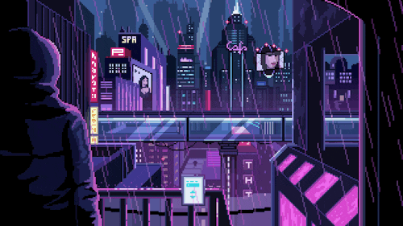
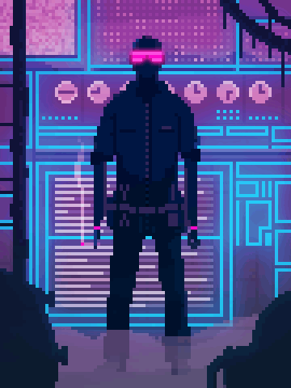
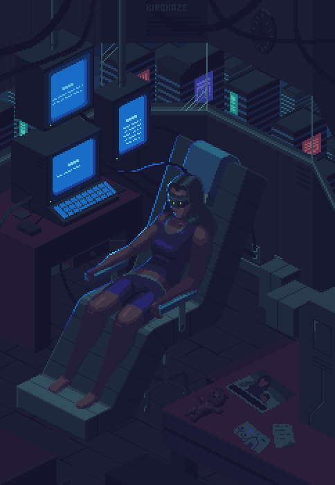
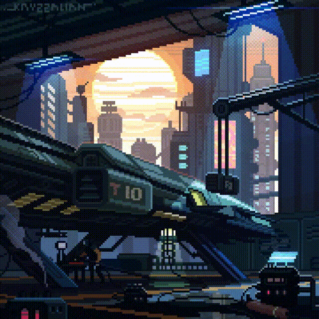

<h1 align="center"> Galeria de pixel art</h1>

A galeria de pixel arts é baseada no conceito japonês de contemplação do vazio, um vazio de significado, uma ambientação que traz sentido do enquanto. Tradicionalmente representado pelo kanji 間.
Imagens que são capazes de dizer tudo mesmo sem dizer nada, basta olhar e se conectar. 

Enquanto eu reuni os gifs não consegui perceber o que eles tinham em comum. Agora eu sei, se eu olhar muito tempo para eles, eles me olham volta.

<h1 align="center"> CIBERPUNK </h1>

|||
|:--:|:----:|
|||
|||
| </img>||
|||
|||
|||

<h1 align="center">MEDIEVAL</h1>

|||
|--|--|
|||
